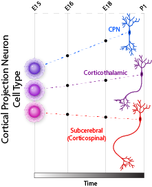
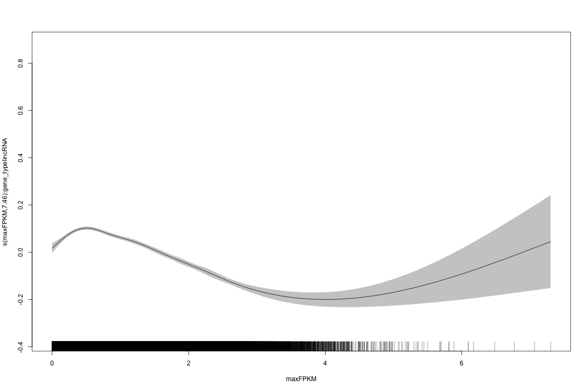
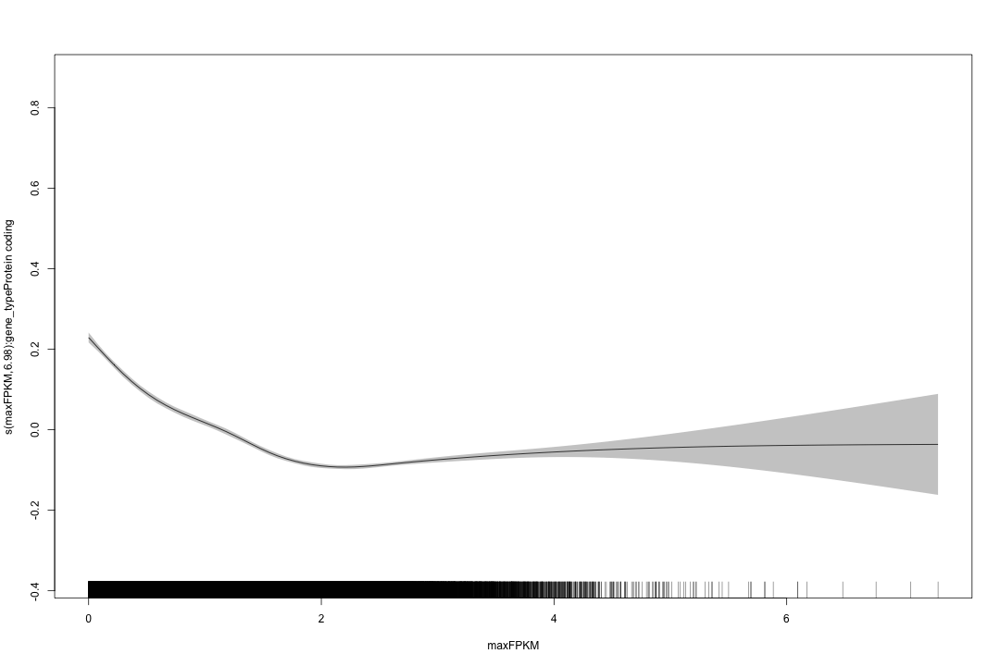

On the specificity of long non-coding RNAs
========================================================


### Introduction
In response to a critical review of a paper in which one section dealt with the relative cell-type specificity of lncRNAs, we have decided to formally test whether this assertation is true.  In previous work, we and others have claimed that lncRNAs are significantly more tissue-specific than protein coding genes of comparable expression levels.  This assertion has been, and remains to be, confounded by the observation that lncRNAs are, on average, expressed at an order of magnitude lower than protein coding genes.

This particular observation complicates the interpretation of lncRNA specificity as it is very likely that a nonlinear, inverse relationship exists between specificity and expression when expression estimates are obtained from high-throughput RNA-sequencing (RNA-Seq). RNA-Seq involves the sampling and sequencing of cDNA fragments obtained from a population of expressed RNAs within a given sample. The likelihood of observing a fragment from a given RNA transcript has been shown to be a function of both the abundance of the transcript as well as its length: a property that has been exploited to great gain in expression studies of late. 

To directly address this concern, we would like to explicitly model the relationship between the maximum expression level of a gene (expressed as Fragments Per Kilobase of RNA per Million fragments mapped; $FPKM$), and the maxiumum specificity score ($S$; defined below). Once we correctly model the dependence of $S$ on expression, we will be able to determine if there remains a significant contribution to $S$ that is a function of the gene type (lncRNA vs protein coding gene).

### Questions
1.  Are lncRNAs more cell type specific than protein coding genes?  
2.  Is the observed specificity exclusively a function of the lower expression regime for lncRNAs?
3.  Are lncRNAs more tissue specific than protein coding genes?

### Definitions
* **Specificity Score** ($S$)
    - Our definition of specificity is entropy-based and compares the normalized expression profile of a given gene $i$ to a unit vector of perfect expression for a given condition $j$ as follows:
    $$  S_i=\max_{j_1:j_n} \left(1-\sqrt{JSD(p_i,\hat{q_j})}\right) $$
    - Where JSD is the Jensen-Shannon divergence, $p_i$ is the log10 expression profile of gene $i$ normalized as a probability vector and $\hat{q_j}$ is the unit vector of 'perfect expression' in condition $j$.
    - The square-root of the Jensen-Shannon divergence is known as the Jensen-Shannon distance and is a valid distance metric that is known to obey the triangle inequality rule. This entropy-based specificity score is our method of choice, but we are open to suggestions for more robust or appropriate scores.

### Cellular context


In this particular analysis, we will use a dataset corresponding to ~8800 genes that were selected as significantly differentially expressed between three different cortical projection neuron subtypes: Corticothalamic (CthPN), Subcerebral (ScPN), and Callosal (CPN). Each of these three cell types was isolated from dissociated mouse cortex at several developmental time points: E15.5 (embryonic day 15.5), E16.5, E18.5, and P1 (postnatal day 1). n=2 purified populations were sorted using a novel technique that allows for selection based on defined neuronal transcription factor markers for each lineage, and for each condition high-quality RNA was obtained.  The RNA was subjected to standard TruSeq library preparation methods and the resulting libraries were sequenced to a mean depth of ~100M 100 bp paired-end fragments. Fragments were aligned to the mouse genome (mm9) using Tophat2 with default parameters.

Aligned reads were used as input for our custom lncRNA discovery pipeline (detailed in XXXXX). Assembled lncRNAs of reasonable quality were added to the UCSC reference catalog of genes to establish a 'reference transcriptome'.  Genes within the reference transcriptome were quantified and tested for differential expression using Cuffdiff 2.1.1, and the data were processed with the cummeRbund R package. A cohort of significant genes was selected between any pairwise conditions using a Benjamini-Hochberg corrected $q\le0.0004$.

Since we are interested in the specificity between these three cell types, and collections were done at several developmental time points.  All aspects of specificity should only be concerned as they pertain to the comparison between the cell types at any given time point. (ie. we are not interested in the specificity of lncRNAs across *all* conditions per se).
<br style="clear:both" />

### Load cortical projection neuron data
Here we will load the neuronal data containing the estimated expression values of the significant genes as well as the gene identifier and a label for gene biotype (lncRNA or protein coding gene).

```r
sigGenes <- read.csv("sigGenes.csv")[, c(1:13, 16)]
sigGenes.melt <- melt(sigGenes)
sigGenes.melt <- cbind(sigGenes.melt, as.data.frame(str_split_fixed(sigGenes.melt$variable, 
    "_", 2)))
colnames(sigGenes.melt) <- c("gene_id", "gene_type", "condition", "fpkm", "time", 
    "cell")

sigGenes.melt$fpkm <- log10(sigGenes.melt$fpkm + 1)

head(sigGenes.melt)
```

```
        gene_id      gene_type condition   fpkm time cell
1 0610007C21Rik Protein coding   E15_cpn 1.5716  E15  cpn
2 0610007P08Rik Protein coding   E15_cpn 0.8700  E15  cpn
3 0610007P14Rik Protein coding   E15_cpn 1.3403  E15  cpn
4 0610009O20Rik Protein coding   E15_cpn 1.3506  E15  cpn
5 0610010O12Rik Protein coding   E15_cpn 0.5443  E15  cpn
6 0610011F06Rik Protein coding   E15_cpn 1.0623  E15  cpn
```

```r
table(sigGenes$gene_type)
```

```

       lincRNA Protein coding 
           806           8058 
```

~10% of the genes within this dataset are annotated as lncRNAs, the remainder are protein coding genes.

To start, we would like to generate a summary of the data to obtain the maximum specificity score and the maximum FPKM value with respect to each gene at each time point.


```r

# Find max fpkm and max specificity for each gene at each timepoint
geneSummary <- sigGenes.melt %.% group_by(gene_id, gene_type, time) %.% summarize(maxFPKM = max(fpkm), 
    maxSpec = maxSpecificity(fpkm), minJSDist = minJSDist(fpkm))

geneSummary <- subset(geneSummary, !is.na(maxSpec))
```

We are specifically removing any gene from this summary where $S$ cannot be determined:
* Absolute zeros across all cell types.
* Divide by zero errors.

### The initial observation
Admittedly, we were quick to claim that lncRNAs are significantly more cell type specific than protein coding genes, owing perhaps to our prior understanding of lncRNA tissue-specificity and assuming that this would extend to the level of individual cell types. We initially made this claim based on the following observations:

```r
p <- ggplot(geneSummary)
p + stat_ecdf(aes(x = maxSpec, color = gene_type)) + theme_bw() + scale_color_manual(values = c("red", 
    "grey5")) + facet_grid(. ~ time) + coord_equal(1)
```

 

Here we see that the empirical cumulative density function (ecdf) of the maximum specificity score $S$ for both protein coding genes and lncRNAs from our set of statistically significant genes indicates that the lncRNAs are far more cell type specific at any time point than protein coding genes. However, this analysis was done without consideration for the distribution of expression values between the two gene types.


```r
p <- ggplot(geneSummary)
p + geom_density(aes(x = maxFPKM, color = gene_type)) + facet_grid(. ~ time) + 
    theme_bw() + scale_color_manual(values = c("red", "black")) + coord_equal(2)
```

 

As our reviewer indicated, there is a strong bias for lncRNAs in the lower end of the expression regime. The next section(s) will detail the reviewer's concerns and attempt to address these issues in sufficient detail.

### The criticism
As suggested above, the reviewer correctly indicates that there is a strong, biasing, inverse relationship between our measure of specificity and the estimated expression of a gene. The reviewers approach to demonstrating this involves sampling protein coding genes from our significant gene list to match the empirical distribution of lncRNAs. Using this approach, combined with a bootstrap analysis for confidence, the reviewer observes that the specificities of down-sampled protein coding genes matches the ecdf for our significant lncRNAs much more closely.


While, we agree with this approach, it struck our interest that even with this analysis, there appears to be a separation between the bootstrapped lncRNA ecdf and that for the sampled protein coding genes with identical distribution. The reviewer claimed that this is evidence that lncRNAs have **'nearly the same cell type specificity as protein coding genes expressed at similar levels'**. We would like to argue however, that this approach has highlighted the fact that once you correct for the differences in expression, that lncRNAs *remain* more specific than protein coding genes, albeit not as dramatically as was indicated by our initial analysis. 

We would like to explore this relationship further and to do so, we will attempt to recreate the reviewer's analysis, and also attempt the inverse to see whether or not we can sample lncRNAs to match the FPKM distribution of protein coding genes.

#### Sampling PC genes from a lncRNA expression distribution
To recapitulate the reviewers analysis, we will focus initially on the E15.5 time point.

```r
# Density estimates
E15.lnc.dens <- density(subset(geneSummary, time == "E15" & gene_type != "Protein coding")$maxFPKM)
E15.PC.dens <- density(subset(geneSummary, time == "E15" & gene_type == "Protein coding")$maxFPKM)

# Learn Empirical distribution for lncRNA genes
E15.lnc.D <- DiscreteDistribution(subset(geneSummary, time == "E15" & gene_type != 
    "Protein coding")$maxFPKM)

# Create weighted probabilities on PC gene FPKM values from which to sample
PC.weights.on.lnc.D <- p(E15.lnc.D)(subset(geneSummary, time == "E15" & gene_type == 
    "Protein coding")$maxFPKM, lower.tail = FALSE)
PC.probs.on.lnc.D <- PC.weights.on.lnc.D/sum(PC.weights.on.lnc.D)

# Sample from PC genes to match lncRNA distribution
samp_PC <- sample(subset(geneSummary, time == "E15" & gene_type == "Protein coding")$maxFPKM, 
    replace = TRUE, size = 10000, prob = PC.probs.on.lnc.D)

# My Sampling function
mySample <- function(x, n, EmpDist) {
    w <- p(EmpDist)(x$maxFPKM, lower.tail = FALSE)
    probs <- w/sum(w)
    samp <- x[sample(nrow(x), replace = TRUE, size = n, prob = probs), ]
    return(samp)
}

# Sanity Check plot
plot(density(mySample(subset(geneSummary, time == "E15" & gene_type == "Protein coding"), 
    n = 806, EmpDist = E15.lnc.D)$maxFPKM), ylim = c(0, 2))
lines(density(r(E15.lnc.D)(806)), col = "blue")
lines(E15.lnc.dens, col = "red")
legend(x = 1, y = 2, legend = c("lncRNA distribution", "Random draws from learned dist", 
    "Sampled PC genes from learned dist"), col = c("red", "blue", "black"), 
    lty = 1)
```

 

It appears that we can, with reasonable approximation, sample protein coding genes that have a similar distribution in expression profiles to lncRNAs. Let's see what happens to the variability over several iterations.


```r
# Bootstrap
nBoot <- 1000

fit1 <- E15.lnc.dens

fit2 <- replicate(nBoot, {
    x <- mySample(subset(geneSummary, time == "E15" & gene_type == "Protein coding"), 
        806, E15.lnc.D)$maxFPKM
    density(x, from = min(fit1$x), to = max(fit1$x))$y
})

fit3 <- apply(fit2, 1, quantile, c(0.025, 0.975))

# Check that 95% CI from PC gene draws has appropriate expression
# distribution
plot(density(r(E15.lnc.D)(1000)), col = "blue", ylim = range(fit3))
polygon(c(fit1$x, rev(fit1$x)), c(fit3[1, ], rev(fit3[2, ])), col = rgb(0.4, 
    0.4, 0.8, 0.3), border = FALSE)
lines(density(r(E15.lnc.D)(806)), col = "blue")
lines(fit1, col = "red")
```

 

Now what does this do to the ecdf? (still in progress)


```r
repFitPC <- replicate(nBoot, {
    x <- mySample(subset(geneSummary, time == "E15" & gene_type == "Protein coding" & 
        !is.na(maxSpec)), 806, E15.lnc.D)$maxSpec
    ecdf(x)
})

repFitPCCI <- apply(repFitPC, 1, function(x) {
    knots(x[1])
})


plot(ecdf(subset(geneSummary, time == "E15" & gene_type == "Protein coding")$maxSpec))
lines(ecdf(subset(geneSummary, time == "E15" & gene_type != "Protein coding")$maxSpec), 
    col = "red")
# polygon( c(fit1$x, rev(fit1$x)), c(repFitPCCI[1,], rev(repFitPCCI[2,])),
# col=rgb(.4,.4,.8,0.3), border=FALSE)

```


#### Sampling lncRNA genes from a PC expression distribution
What we would like to do is to invert this analysis and ask what happens when we sample lncRNAs that are identically distributed with protein coding genes. This turns out to be difficult in the cortical projection neuron data owing in part to the fact that there are very few lncRNAs in the higher-expression regime from which to sample.


```r
# Learn Empirical distribution for PC genes
E15.PC.D <- DiscreteDistribution(subset(geneSummary, time == "E15" & gene_type == 
    "Protein coding")$maxFPKM)

# Create weighted probabilities on PC gene FPKM values from which to sample
lnc.weights.on.PC.D <- p(E15.PC.D)(subset(geneSummary, time == "E15" & gene_type != 
    "Protein coding")$maxFPKM, lower.tail = FALSE)
lnc.probs.on.PC.D <- lnc.weights.on.PC.D/sum(lnc.weights.on.PC.D)

# Sample from PC genes to match lncRNA distribution
samp_lncs <- sample(subset(geneSummary, time == "E15" & gene_type != "Protein coding")$maxFPKM, 
    replace = TRUE, size = 10000, prob = lnc.probs.on.PC.D)

# My Sampling function
mySample <- function(x, n, EmpDist) {
    w <- p(EmpDist)(x$maxFPKM, lower.tail = FALSE)
    probs <- w/sum(w)
    samp <- x[sample(nrow(x), replace = TRUE, size = n, prob = probs), ]
    return(samp)
}

# Sanity Check plot
plot(density(mySample(subset(geneSummary, time == "E15" & gene_type != "Protein coding"), 
    n = 8000, EmpDist = E15.PC.D)$maxFPKM))
lines(density(r(E15.PC.D)(8000)), col = "blue")
lines(E15.PC.dens, col = "red")
legend(x = 1, y = 2, legend = c("PC distribution", "Random draws from learned dist", 
    "Sampled lncRNA genes from learned dist"), col = c("red", "blue", "black"), 
    lty = 1)
```

 

In this case, it's exceedingly difficult to sample lncRNAs in the same regime of expression as there are so few lncRNAs in the range of expression as protein coding genes. So this will not be a viable option going forward.


```r
# Bootstrap
nBoot <- 1000

fit1 <- E15.PC.dens

fit2 <- replicate(nBoot, {
    x <- mySample(subset(geneSummary, time == "E15" & gene_type != "Protein coding"), 
        8000, E15.PC.D)$maxFPKM
    density(x, from = min(fit1$x), to = max(fit1$x))$y
})

fit3 <- apply(fit2, 1, quantile, c(0.025, 0.975))

# Check that 95% CI from PC gene draws has appropriate expression
# distribution
plot(density(r(E15.PC.D)(1000)), col = "blue", ylim = range(fit3))
polygon(c(fit1$x, rev(fit1$x)), c(fit3[1, ], rev(fit3[2, ])), col = rgb(0.4, 
    0.4, 0.8, 0.3), border = FALSE)
lines(density(r(E15.PC.D)(8000)), col = "blue")
lines(fit1, col = "red")
```


### What if we ignore the 'noise'-end of the expression regime?
One of the ways that we have addressed this criticism in the past, as it pertained to tissue specificity, is to remove the effect of 'low-expressing' genes that would bias specificity towards the higher end. To this end, one of the things that we can do is to filter for those genes with a minimum FPKM value of 3.  

```r
p <- ggplot(geneSummary)
p + geom_density(aes(x = maxFPKM, color = gene_type)) + facet_grid(. ~ time) + 
    theme_bw() + scale_color_manual(values = c("red", "black")) + coord_equal(2) + 
    geom_vline(xintercept = fpkmCutoff, linetype = "dashed", color = "grey50") + 
    annotate("text", label = "FPKM threshold", x = fpkmCutoff, y = 1, angle = 90, 
        vjust = 1.5, hjust = 0)
```

 


Assuming that gene must have fpkm greater than cutoff at given timepoint

```r
# fpkmCutoff<-log10(2)
p <- ggplot(subset(geneSummary, maxFPKM >= fpkmCutoff))
p + stat_ecdf(aes(x = maxSpec, color = gene_type)) + facet_grid(. ~ time) + 
    theme_bw() + scale_color_manual(values = c("red", "black")) + coord_equal(1)
```

 

The effect on specificity is reduced, however the lncRNAs still appear to be more tissue specific.  The problem with this analysis is that while we have removed the more strongly biasing low-expressing genes, we still have differences in the underlying distributions between lncRNAs and protein coding genes and this difference is most likely affecting our interpretations.


```r
p + geom_density(aes(x = maxFPKM, color = gene_type)) + facet_grid(. ~ time) + 
    theme_bw() + scale_color_manual(values = c("red", "black")) + coord_equal(1) + 
    ggtitle(paste("maxFPKM for genes with FPKM >= ", 10^fpkmCutoff, sep = ""))
```

 

Indeed there is still a noticible difference in expression estimates using a 'hard-cutoff' approach.  It is encouraging that the specificity scores are still separating, but if there is a continuous relationship between specificity and expression than this may be affecting our interpretations of this reduced subset as well.

### Modeling specificity as a function of expression
What we would really like to do here is appropriately model the relationship between specificity ($S$) and expression (maxFPKM). To do this, we will have to first explore the relationship between these two variables.

First, lets look at the distribution of $S$:

```r
# What is the prob. distribution of the response variable (maxSpec)
p <- ggplot(geneSummary)
p + geom_density(aes(x = maxSpec)) + theme_bw()
```

 

There are a few edge cases with 'perfect specificity' ($S=1.0$) that cannot be modeled as a continuous function.  We will leave them in for now, but we may need to remove them and model them separately. Otherwise, the distribution is reasonably approximated by a gaussian.

*Note: I am very unclear as to the appropriate probability distribution from which $S$ should be drawn. I'm using gaussian at this point, and I've flirted with a beta distribution since $S$ is bounded [0-1]. This aspect, combined with an appropriate choice for a link function is the thing that I am most unsure of moving forward.*

#### A look at the relationship between specificity and expression

```r
p <- ggplot(geneSummary)
p + geom_point(mapping = aes(x = maxFPKM, y = maxSpec), color = "black", alpha = 0.3, 
    data = subset(geneSummary, gene_type == "Protein coding")) + geom_point(mapping = aes(x = maxFPKM, 
    y = maxSpec), color = "red", data = subset(geneSummary, gene_type != "Protein coding")) + 
    facet_grid(gene_type ~ time) + theme_bw() + coord_equal(4)
```

 

The relationship between $S$ and maxFPKM is a continuous function that can be reasonably approximated by fitting the two variables using a cubic spline.


```r
p + geom_smooth(aes(x = maxFPKM, y = maxSpec, color = gene_type, fill = gene_type), 
    method = "auto") + facet_grid(. ~ time) + theme_bw() + scale_color_manual(values = c("red", 
    "black")) + scale_fill_manual(values = c("red", "grey50")) + coord_equal(4)
```

 

While the two curves are very similar, there does appear to be some separation in the regime of ~5-50 FPKM.  Let's try and model this relationship and see if gene_type has any influence over the shape of these data.

#### Fitting a generalized additive model
Owing to the quadratic relationship between $S$ and max FPKM, we decided to model the data by fitting maxFPKM using a cubic spline.

```r

########################################## Cell-level model (projection neurons) #

fit1 <- gam(maxSpec ~ s(maxFPKM, bs = "cs") + gene_type + time, dat = geneSummary, 
    family = gaussian)  # I actually think it should be a truncated gaussian or beta, but I'm not entirely sure

# Fitting vgam using beta distribution instead of gaussian
# fit1<-vgam(maxSpec~s(maxFPKM)+gene_type+time,dat=subset(geneSummary,!is.na(maxSpec)
# & maxSpec<1.0),family=beta.ab(A = 0.10, B = 1.0))
# fit2<-vgam(maxSpec~s(maxFPKM)+time,dat=subset(geneSummaryAIC,!is.na(maxSpec)
# & maxSpec<1.0),family=beta.ab(A = 0.10, B = 1.0)) mycol<-c('red','blue')
# plot(fit1,se=TRUE,overlay=TRUE,llwd=2,lcol=mycol,scol=mycol)

fit1
```

```

Family: gaussian 
Link function: identity 

Formula:
maxSpec ~ s(maxFPKM, bs = "cs") + gene_type + time

Estimated degrees of freedom:
8.98  total = 13.98 

GCV score: 0.00587
```

```r

summary(fit1)
```

```

Family: gaussian 
Link function: identity 

Formula:
maxSpec ~ s(maxFPKM, bs = "cs") + gene_type + time

Parametric coefficients:
                        Estimate Std. Error t value Pr(>|t|)    
(Intercept)              0.39912    0.00165  241.44  < 2e-16 ***
gene_typeProtein coding -0.02553    0.00156  -16.35  < 2e-16 ***
timeE16                  0.00447    0.00115    3.87  0.00011 ***
timeE18                  0.00764    0.00116    6.61  3.8e-11 ***
timeP1                   0.01070    0.00116    9.24  < 2e-16 ***
---
Signif. codes:  0 '***' 0.001 '**' 0.01 '*' 0.05 '.' 0.1 ' ' 1

Approximate significance of smooth terms:
            edf Ref.df    F p-value    
s(maxFPKM) 8.98      9 1630  <2e-16 ***
---
Signif. codes:  0 '***' 0.001 '**' 0.01 '*' 0.05 '.' 0.1 ' ' 1

R-sq.(adj) =  0.357   Deviance explained = 35.7%
GCV score = 0.0058696  Scale est. = 0.0058673  n = 35392
```

```r

anova(fit1)
```

```

Family: gaussian 
Link function: identity 

Formula:
maxSpec ~ s(maxFPKM, bs = "cs") + gene_type + time

Parametric Terms:
          df     F p-value
gene_type  1 267.4  <2e-16
time       3  31.2  <2e-16

Approximate significance of smooth terms:
            edf Ref.df    F p-value
s(maxFPKM) 8.98   9.00 1630  <2e-16
```

```r

plot(fit1, resid = T, pages = 1, all.terms = T, rug = F, shade = T)
```

 

```r

geneSummary.fitStats <- cbind(geneSummary, residuals = resid(fit1), fitted = fitted(fit1))
# p<-ggplot(geneSummary.fitStats) p +
# geom_point(aes_string(x='maxSpec',y='fitted',color='gene_type'),alpha=0.3)
# + theme_bw() + scale_color_manual(values=c('red','black')) +
# geom_abline(intercept=0,slope=1,lty='dashed')
```

This model fits $S$ as a smoothed function of maxFPKM as well as gene_type and time.  Time is relevant in this context because there are only three distinct cell types in these data, and we are not directly interested in specificity over all 12 conditions, but rather specificity for a given cell type at each of the 4 time points.

This being said, the model is a reasonable fit and explains ~78.8% of the deviance ($R^2$=.787). The smooth fit appears to explain the largest fraction of the data, however, we note the significant effect of gene_type on $S$. Specifically, after accounting for expression, there remains a significant effect (t=-4.627;p<3.72e-06) between protein coding genes and lncRNAs.  This effect manifests as a significant reduction in $S$ for protein coding genes relative to lncRNAs. This result is consistent with our hypothesis that gene type does have an effect on specificity and that lncRNAs are more specific than protein coding genes, even after accounting for differences in expression.

Interestingly we also find evidence to support our other claim that there is an increase in cell specificity over time for our cortical projection neurons. Relative to the baseline E15.5 time point, we see a significant trend in an increase in $S$ after correcting for both gene type and expression level.

#### Comparison to a nested model without gene_type as a parameter
To confirm that our lncRNA specificity result is significant, we would like to compare the above model to a nested model without gene_type as a parameter.


```r
fit_null <- gam(maxSpec ~ s(maxFPKM, bs = "cs") + time, dat = geneSummary)

fit_null
```

```

Family: gaussian 
Link function: identity 

Formula:
maxSpec ~ s(maxFPKM, bs = "cs") + time

Estimated degrees of freedom:
8.98  total = 12.98 

GCV score: 0.005914
```

```r

summary(fit_null)
```

```

Family: gaussian 
Link function: identity 

Formula:
maxSpec ~ s(maxFPKM, bs = "cs") + time

Parametric coefficients:
            Estimate Std. Error t value Pr(>|t|)    
(Intercept) 0.375626   0.000821  457.64  < 2e-16 ***
timeE16     0.004706   0.001158    4.06  4.8e-05 ***
timeE18     0.008069   0.001160    6.96  3.5e-12 ***
timeP1      0.011075   0.001162    9.53  < 2e-16 ***
---
Signif. codes:  0 '***' 0.001 '**' 0.01 '*' 0.05 '.' 0.1 ' ' 1

Approximate significance of smooth terms:
            edf Ref.df    F p-value    
s(maxFPKM) 8.98      9 2138  <2e-16 ***
---
Signif. codes:  0 '***' 0.001 '**' 0.01 '*' 0.05 '.' 0.1 ' ' 1

R-sq.(adj) =  0.352   Deviance explained = 35.2%
GCV score = 0.0059137  Scale est. = 0.0059115  n = 35392
```

```r

anova(fit_null)
```

```

Family: gaussian 
Link function: identity 

Formula:
maxSpec ~ s(maxFPKM, bs = "cs") + time

Parametric Terms:
     df    F p-value
time  3 33.4  <2e-16

Approximate significance of smooth terms:
            edf Ref.df    F p-value
s(maxFPKM) 8.98   9.00 2138  <2e-16
```

```r

plot(fit_null, resid = T, pages = 1, all.terms = T, rug = F, shade = T)
```

 

This model is also a very reasonable fit, and does appear to explain a lower amount of the deviance than the full model. 


```r

# Analysis of Deviance
anova(fit_null, fit1, test = "F")
```

```
Analysis of Deviance Table

Model 1: maxSpec ~ s(maxFPKM, bs = "cs") + time
Model 2: maxSpec ~ s(maxFPKM, bs = "cs") + gene_type + time
  Resid. Df Resid. Dev Df Deviance   F Pr(>F)    
1     35379        209                           
2     35378        208  1     1.57 267 <2e-16 ***
---
Signif. codes:  0 '***' 0.001 '**' 0.01 '*' 0.05 '.' 0.1 ' ' 1
```


#### Questions
1. Is a gam model the best choice here?
2. Is this a reasonable fit?
3. Should I be using a different distribution:link for the response?
4. Based on the relationship between $S$ and FPKM and the fact that we are explicitly removing any genes with maxFPKM == 0, is it reasonable/appropriate to remove the intercept from the models? The explained deviance is a good deal higher, but I'm not sure what the implications are. 
5. Does the fact that gene_type contributes significantly between the two models count as strong enough evidence that lncRNAs are cell type specific?
6. There is a good deal of heteroscedasticity in the relationship between $S$ and maxFPKM.
  - Is this a concern for the fit, and if so how much?
  - Can this be accounted for by adjusting the model or link function in any way?
7. Does this relationship hold up when compared across *tissues* (a relationship that is generally believed to be true)? (see next section)

### Are lncRNAs more tissue specific?
Here we will be using a version of our lncRNA catalog that has been built on a large cohort of mouse tissues. We have quantified the expression of 42,637 mouse genes across 63 different tissues and cellular conditions.  Included in this list are 25,637 protein coding genes and 17,000 lncRNAs.

```r
tissue.dat <- read.table("tissue_survey.tab", header = T, sep = "\t")

# Remove genes with no expression in any condition
tissue.dat <- tissue.dat[apply(tissue.dat[, -1], 1, sum) > 0, ]

# log transform
tissue.dat[, -1] <- log10(tissue.dat[, -1] + 1)

tissue.dat$gene_type <- "Protein coding"
tissue.dat$gene_type[grepl("^XLOC_", tissue.dat$gene_id)] <- "lincRNA"

tissue.melt <- melt(tissue.dat, id.vars = c("gene_id", "gene_type"))

colnames(tissue.melt) <- c("gene_id", "gene_type", "tissue", "fpkm")


# tissue.melt$fpkm<-log10(tissue.melt$fpkm+1)

head(tissue.melt)
```

```
        gene_id      gene_type     tissue   fpkm
1 0610007C21Rik Protein coding C2C12_5day 1.9234
2 0610007L01Rik Protein coding C2C12_5day 1.2339
3 0610007P08Rik Protein coding C2C12_5day 0.2505
4 0610007P14Rik Protein coding C2C12_5day 1.1687
5 0610007P22Rik Protein coding C2C12_5day 1.2842
6 0610008F07Rik Protein coding C2C12_5day 0.0000
```

```r

geneSummaryTissue <- tissue.melt %.% group_by(gene_id, gene_type) %.% summarize(maxFPKM = max(fpkm), 
    maxSpec = maxSpecificity(fpkm))

geneSummaryTissue.bak <- geneSummaryTissue
```

We have removed genes with absolute zero expression in all conditions, log-transformed the fpkm, and summarized across individual genes to generate a maxFPKM and $S$ score across all conditions.

The relationship between $S$ and maxFPKM is continuous except for the extreme values of $S$. Since $S$ has an upper bound of 1.0, we don't want this to bias the model fit, so we are removing the genes with perfect specificity at any maxFPKM level first. (is this necessary?) Now we fit using the same parameters and model design as above.


```r
geneSummaryTissue <- subset(geneSummaryTissue, maxSpec < 1 & !is.na(maxSpec))

p <- ggplot(geneSummaryTissue)

p + geom_density(aes(x = maxFPKM, color = gene_type)) + theme_bw() + scale_color_manual(values = c("red", 
    "black"))
```

 

```r

p + geom_point(mapping = aes(x = maxFPKM, y = maxSpec), color = "black", alpha = 0.3, 
    data = subset(geneSummaryTissue, gene_type == "Protein coding")) + geom_point(mapping = aes(x = maxFPKM, 
    y = maxSpec), color = "black", alpha = 0.3, data = subset(geneSummaryTissue, 
    gene_type != "Protein coding")) + theme_bw() + facet_wrap("gene_type")
```

 

```r

p + geom_smooth(aes(x = maxFPKM, y = maxSpec, color = gene_type, fill = gene_type), 
    method = "auto") + theme_bw() + scale_color_manual(values = c("red", "black")) + 
    scale_fill_manual(values = c("red", "grey50")) + coord_equal(6)
```

 

```r

p + geom_density(aes(x = maxSpec, color = gene_type)) + theme_bw() + scale_color_manual(values = c("red", 
    "black"))
```

 

```r
p + stat_ecdf(aes(x = maxSpec, color = gene_type)) + theme_bw() + scale_color_manual(values = c("red", 
    "black"))
```

 

```r

####################### Tissue-level model #

tissue.fit1 <- gam(maxSpec ~ s(maxFPKM, bs = "cs") + gene_type, dat = geneSummaryTissue)
# tissue.fit1<-vgam(maxSpec~s(maxFPKM)+gene_type,dat=geneSummaryTissue,family=beta.ab(A
# = 0.0, B = 1.0))
tissue.fit1
```

```

Family: gaussian 
Link function: identity 

Formula:
maxSpec ~ s(maxFPKM, bs = "cs") + gene_type

Estimated degrees of freedom:
8.94  total = 10.94 

GCV score: 0.03572
```

```r

summary(tissue.fit1)
```

```

Family: gaussian 
Link function: identity 

Formula:
maxSpec ~ s(maxFPKM, bs = "cs") + gene_type

Parametric coefficients:
                        Estimate Std. Error t value Pr(>|t|)    
(Intercept)              0.26498    0.00182     145   <2e-16 ***
gene_typeProtein coding -0.05567    0.00253     -22   <2e-16 ***
---
Signif. codes:  0 '***' 0.001 '**' 0.01 '*' 0.05 '.' 0.1 ' ' 1

Approximate significance of smooth terms:
            edf Ref.df   F p-value    
s(maxFPKM) 8.94      9 583  <2e-16 ***
---
Signif. codes:  0 '***' 0.001 '**' 0.01 '*' 0.05 '.' 0.1 ' ' 1

R-sq.(adj) =  0.216   Deviance explained = 21.6%
GCV score = 0.035724  Scale est. = 0.035713  n = 37452
```

```r

anova(tissue.fit1)
```

```

Family: gaussian 
Link function: identity 

Formula:
maxSpec ~ s(maxFPKM, bs = "cs") + gene_type

Parametric Terms:
          df   F p-value
gene_type  1 486  <2e-16

Approximate significance of smooth terms:
            edf Ref.df   F p-value
s(maxFPKM) 8.94   9.00 583  <2e-16
```

```r

plot(tissue.fit1, residuals = T, shade = T)
```

 

```r

tissue.fit_null <- gam(maxSpec ~ s(maxFPKM, bs = "cs"), dat = geneSummaryTissue)

tissue.fit_null
```

```

Family: gaussian 
Link function: identity 

Formula:
maxSpec ~ s(maxFPKM, bs = "cs")

Estimated degrees of freedom:
8.92  total = 9.92 

GCV score: 0.03619
```

```r

summary(tissue.fit_null)
```

```

Family: gaussian 
Link function: identity 

Formula:
maxSpec ~ s(maxFPKM, bs = "cs")

Parametric coefficients:
            Estimate Std. Error t value Pr(>|t|)    
(Intercept) 0.231009   0.000983     235   <2e-16 ***
---
Signif. codes:  0 '***' 0.001 '**' 0.01 '*' 0.05 '.' 0.1 ' ' 1

Approximate significance of smooth terms:
            edf Ref.df    F p-value    
s(maxFPKM) 8.92      9 1082  <2e-16 ***
---
Signif. codes:  0 '***' 0.001 '**' 0.01 '*' 0.05 '.' 0.1 ' ' 1

R-sq.(adj) =  0.206   Deviance explained = 20.6%
GCV score = 0.036186  Scale est. = 0.036177  n = 37452
```

```r

anova(tissue.fit_null)
```

```

Family: gaussian 
Link function: identity 

Formula:
maxSpec ~ s(maxFPKM, bs = "cs")

Approximate significance of smooth terms:
            edf Ref.df    F p-value
s(maxFPKM) 8.92   9.00 1082  <2e-16
```

```r

plot(tissue.fit_null, residuals = T, shade = T, all.terms = T, pages = 1)
```

 

```r


# Analysis of Deviance
anova(tissue.fit_null, tissue.fit1, test = "F")
```

```
Analysis of Deviance Table

Model 1: maxSpec ~ s(maxFPKM, bs = "cs")
Model 2: maxSpec ~ s(maxFPKM, bs = "cs") + gene_type
  Resid. Df Resid. Dev   Df Deviance   F Pr(>F)    
1     37442       1355                             
2     37441       1337 1.02     17.4 476 <2e-16 ***
---
Signif. codes:  0 '***' 0.001 '**' 0.01 '*' 0.05 '.' 0.1 ' ' 1
```


### Bootstrapping analysis?
Another alternative would be to bootstrap a significance value for the difference in $S$ between lncRNAs and PC genes.

What percentage of the times after shuffling gene_type labels, do we end up with a mean $S$ that is as extreme or lower than the mean $S$ for lncRNAs?

(in progress)


### Conclusions

### Session Information

```r
sessionInfo()
```

```
R version 3.1.0 (2014-04-10)
Platform: x86_64-apple-darwin13.1.0 (64-bit)

locale:
[1] en_US.UTF-8/en_US.UTF-8/en_US.UTF-8/C/en_US.UTF-8/en_US.UTF-8

attached base packages:
[1] stats     graphics  grDevices utils     datasets  methods   base     

other attached packages:
 [1] mgcv_1.7-29              nlme_3.1-117            
 [3] distr_2.5.2              SweaveListingUtils_0.6.1
 [5] sfsmisc_1.0-25           startupmsg_0.9          
 [7] dplyr_0.1.3              stringr_0.6.2           
 [9] reshape2_1.4             ggplot2_0.9.3.1         
[11] knitr_1.5               

loaded via a namespace (and not attached):
 [1] assertthat_0.1   colorspace_1.2-4 digest_0.6.4     evaluate_0.5.3  
 [5] formatR_0.10     grid_3.1.0       gtable_0.1.2     labeling_0.2    
 [9] lattice_0.20-29  MASS_7.3-32      Matrix_1.1-3     munsell_0.4.2   
[13] plyr_1.8.1       proto_0.3-10     Rcpp_0.11.1      scales_0.2.4    
[17] tools_3.1.0     
```


